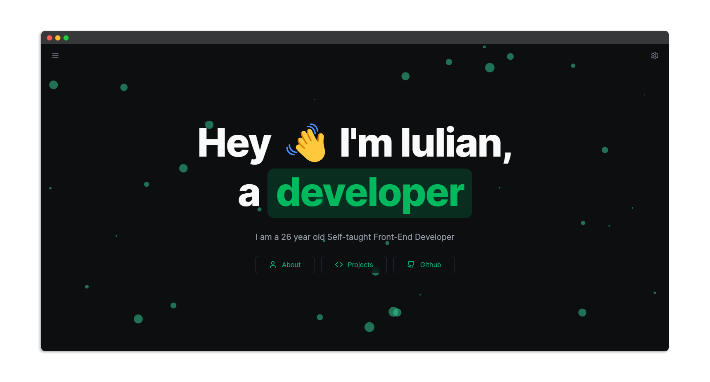

<div align="center">

<a target="_blank" href="https://www.iulianursu.dev/">
    
</a>

[](https://www.codefactor.io/repository/github/iulian-u/iulianursu.dev)


[](https://www.iulianursu.dev/)
[](https://github.com/Iulian-U/iulianursu.dev/blob/main/LICENSE)
[](https://vercel.com)
</div>


## ⚙️ Stack


</br>

## 🛠 Development

Clone the repository

```zsh
git clone https://github.com/Iulian-U/iulianursu.dev.git
```

Install dependencies

```zsh
npm install
# Or using Yarn
yarn
```

Start the development server

```zsh
npm run dev
# Or using Yarn
yarn dev
```

Build for production

```zsh
npm run build
# Or using Yarn
yarn
```

## 📄 License

MIT © [Iulian Ursu](https://github.com/Iulian-U/iulianursu.dev/blob/main/LICENSE)
